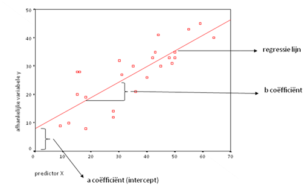
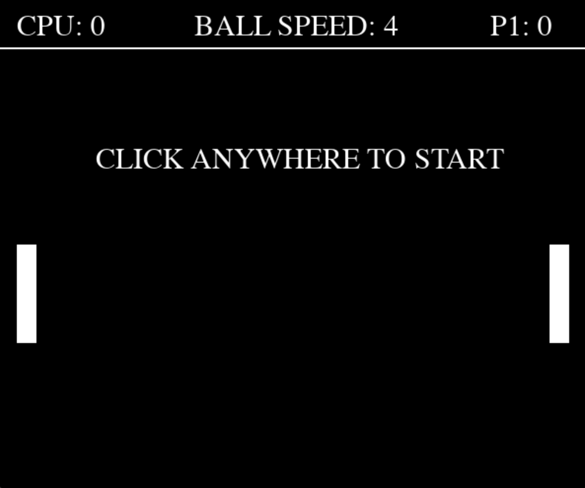

# Pong AI

## Content table
1. [Introduction](#introduction)
2. [Goals](#Goals)
3. [Problemstatement](#problemstatement)
3. [Analyse](#Analyse)
4. [Results](#Results)
5. [Expansion](#Expansion)
6. [Conclusion](#Conclusion)
7. [Bibliography](#Bibliography)

## Introduction

This project is a thesis for the module AI-Programming by William Rogov. For this thesis I have chosen to make and integrate an AI to the populair and timeless game "Pong".This README.MD file will contain explaination about the project. 

## Goals
#### Main-Goal
The main goal of this project, is to create a Pong A.I that moves the paddle accordingly to defeat the player (you). This AI should be able to play in a way that is realistic and fair so that the user (player) wouldn't "feel" the difference between the AI and human opponent
#### Sub-Goals
The Sub-Goals for this project differ in alot of ways, here is a small list of potential Sub-Goals:

1. Making a working envirement (playingfield, paddles etc...)
2. Making a working AI (AI-Player)
3. Programming the controls
4. Making a working scoreboard
5. ...

## Problem statement

#### 1. The main problem?
The primary problem we aim to tackle is the creation of an artificial intelligence capable of playing Pong at an advanced level and how to integrate AI into a classic game like Pong without losing its essence. This involves understanding the game's rules, making strategic decisions, and enhancing performance. Despite the seemingly simple nature of Pong, it poses a challenge for AI due to the need for rapid responses to changing conditions.

#### 2. Social context?
In the societal context, the project contributes to the ongoing advancement of artificial intelligence. The ability to play Pong serves as a test case for the development of intelligent systems capable of handling more complex tasks, such as autonomous vehicles, medical diagnoses, or the analysis of large datasets.

#### 3. Target audience?
The target audience for this project includes researchers and developers in the field of artificial intelligence, as well as the broader community interested in the progress of AI technologies. By creating an AI that can play Pong, we contribute to the understanding of enhancements of the capabilities of AI in various application domains.

## Analyse

#### Relatable projects?

In the vast landscape of AI applications in gaming, our project aligns with the challenge of programming AI for complex tasks. Major AAA titles like Call of Duty and Grand Theft Auto exemplify the utilization of advanced AI. These games aim to create opponents with human-like behavior, immersing players in a virtual world. The parallels highlight the significance of AI in enhancing gaming experiences.

In this GIF, we witness how an AI is learning to play a basketball game.

#### Dataset(s) or libraries?

Despite its apparent simplicity, our Pong AI project strategically employs datasets and libraries. The core library, "Pygame," lays the foundation for the Pong environment, enabling the creation of a visually engaging and interactive setting. Additionally, "sklearn" facilitates AI calculations, while "Numpy" handles numerical operations. The balanced use of these tools showcases a meticulous approach tailored to the project's requirements.

#### Algorithme?
A standout feature of my project is the incorporation of a simple yet effective AI algorithm—linear regression. This intentional choice aligns with the project's objectives. Linear regression, valued for its simplicity and interpretability, fits scenarios where a linear relationship is assumed between input(the current location of the ball) and output(the location that the ball is heading to, influenced by the speed). In our context, it establishes a correlation between the ball's x-position and the CPU paddle's y-position.

### Linear Regression Unveiled:
Why Linear Regression? 

Its simplicity and interpretability make it suitable when anticipating a linear correlation.
Application in Pong: The linear regression model predicts CPU paddle movement based on the ball's current position. It empowers the model to make informed predictions, injecting dynamism into the CPU paddle's response.
This deliberate use of linear regression serves as an educational example, demonstrating the application of machine learning principles in basic gaming environments. While the project introduces linear regression, real-world applications may demand more complex algorithms based on problem intricacies.

#### Relevant tools?

The project leverages widely adopted tools in the programming community:

Python: A versatile and powerful language serving as the backbone for implementing game logic, algorithme and AI.

Visual Studio Code: A popular code editor chosen for its user-friendly interface and robust features, providing an efficient environment for development and debugging.It is also available on (almost) every OS, which makes it very accesible for every curious user.

#### Target/inference?

The primary inference goal revolves around predicting CPU paddle movement based on the ball's current position. The linear regression model, meticulouslydynamically adjusts the CPU paddle's behavior, adding responsiveness and challenge to the game.

#### Hardware?

The project's hardware requirements are modest, demonstrated by its development on a MacBook. Standard PCs or desktops can effortlessly run this undemanding project, ensuring accessibility to a broader audience.

#### Software/ OS?

The project's software ecosystem centers around Visual Studio Code, a widely embraced code editor known for its versatility. While development occurred on MacOS, the project's compatibility ensures seamless execution across diverse operating systems, enhancing accessibility.

#### Software deployement?

Given the project's simplicity, deploying it as an .exe file emerges as an optimal solution. This streamlined approach ensures straightforward execution on various platforms, reflecting a commitment to user-friendly deployment.

(NOTE: An attempt of implementing the project in to an .exe file can be find in this reposetory, but it isn't functional.)

## Results

After the meticulous process of creating the Pong AI, let's delve into a comprehensive reflection on the results and the key components that shape the game.

The main parts of this game are:

1. The enviroment
2. The paddle
3. The control display
4. The ball
### The enviroment

By using Pygame, I could create the iconic look of the Pong game.
### The paddle
The paddle of the player can be moved using the up- &#8595; or down- &#8593;
keys on your keyboard. The ball will bounce off any side of the screen if it hits a wall. If you score a point by hitting the wall.
It is not possible to move the ball with the mouse. This means that the only way to control the direction of the ball is the keyboard. The left paddle is controlled by the PC/CPU.

### The control display

The control display acts as the informational hub of the game, offering insights into crucial aspects of gameplay. The display includes the player's score, providing immediate feedback on their performance. The current ball speed, which indicating the ball's speed, introduces an intriguing dynamic to the game and score Tracking. We will discuss these features in depth.

Score Tracking

The score is prominently displayed next to the player's name, offering a clear and constant reference point. Each successful hit on the opponent's wall results in a point, dynamically altering the score.

Speed Dynamics

At the heart of the control display lies the dynamic indicator of the ball's speed. This intentional design choice introduces a gradual increase in speed as the game progresses. The speed factor adds an element of challenge, keeping players engaged and responsive to the evolving difficulty.

### The ball

The ball, as the primary entity in the game, undergoes dynamic interactions with paddles and walls. Its speed, a critical parameter, evolves throughout the game, intensifying the challenge. If the ball makes contact with the walls behind the paddles, the scoreboard undergoes timely adjustments.
## Future Directions and Expansion

While the current iteration of the Pong AI project provides a solid foundation, there are avenues for expansion and enhancement:

1. AI Paddle Complexity
Currently, the AI-controlled paddle operates with a basic algorithm. Future iterations could explore more sophisticated AI techniques, introducing adaptive strategies based on player behavior.

2. Game Customization
Introducing features like customizable ball speed, paddle sizes, or game modes could add depth to the gaming experience. Such customization options cater to diverse player preferences.

3. Multiplayer Functionality
Expanding the game to accommodate multiplayer interactions could elevate the competitive aspect. Whether locally or online, multiplayer functionality would amplify the social dimension of the game.

4. Visual and Audio Enhancements
Consideration for visual and audio enhancements, from more polished graphics to engaging sound effects, can contribute to a more immersive gaming atmosphere.

## Conclusion

The Pong AI project has successfully achieved its primary goal of enhancing the classic Pong game with artificial intelligence (AI) while maintaining the nostalgic essence of the original gameplay. The objectives were to implement a responsive AI-controlled paddle, introduce dynamic elements such as increasing ball speed, and create an engaging user experience.

Comparing the initial objectives with the final result, the project can be deemed successful. The implementation of a linear regression-based AI for the CPU-controlled paddle adds an element of unpredictability to the game, providing a challenge for players. The dynamic ball speed progression fulfills the goal of gradually increasing difficulty, keeping players engaged.

The project not only succeeds in achieving its objectives but also serves as a solution to the initial problem statement: how to integrate AI into a classic game like Pong without losing its essence. The linear regression model, though simple, effectively predicts the CPU paddle's movements based on the ball's position, offering a balanced and enjoyable gaming experience.

In conclusion, the Pong AI project not only meets its set objectives but also provides a viable solution to the challenge posed. The combination of classic gameplay and modern AI elements creates a harmonious blend that caters to both nostalgia seekers and those looking for an enhanced gaming experience.

## Bibliography

1. Chat-GPT
2. Bard
3. https://www.ibm.com/topics/linear-regression#:~:text=Resources-,What%20is%20linear%20regression%3F,is%20called%20the%20independent%20variable.
4. https://realpython.com/linear-regression-in-python/

5. https://www.vg247.com/you-know-you-want-to-play-massively-multiplayer-pong

6. https://www.google.com/url?sa=i&url=https%3A%2F%2Ftenor.com%2Fview%2Fpong-game-retro-gif-12729647&psig=AOvVaw0x53QMdY4hA_pJmDOiNJ28&ust=1701386003886000&source=images&cd=vfe&opi=89978449&ved=0CBMQ3YkBahcKEwi45fj0quqCAxUAAAAAHQAAAAAQCQ

7. https://www.wired.com/2015/01/ralph-baer-al-alcorn-pioneer-award-dice/

8. https://scikit-learn.org/stable/getting_started.html

9. https://github.com/srimani-programmer/Ping-Pong-Game

